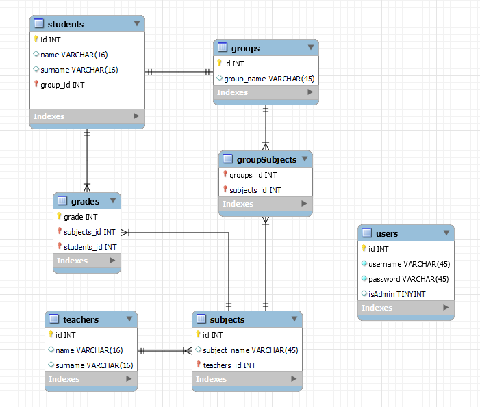

# CRUD

## Задание: CRUD пяти таблиц с использованием PHP и архитектуры MVC.

## Требования к заданию:
1. Хотя бы две таблицы должны иметь связь "многие ко многим"
2. Хотя бы одна страница среди всех должна иметь функционал добавления\редактирования\удаления с помощью AJAX
3. На каждую таблицу должна быть своя страница
4. На таблицы, со связью "многие ко многим" так же отдельная страница
5. Реализовать сортировку таблиц на странице. Как это сделать так же можешь решить сам
6. Должна быть авторизация с разграничением ролей. Роли пусть будут администратор и наблюдатель. Администратор может создавать\удалять\редактировать\смотреть, а наблюдатель просто смотреть. Логин или имя пользователя сам реши, куда выводить
7. Естественно, что все данные хранятся в СУБД. Используй MySQL, хотя, можешь и что-то другое на выбор. Главное чтобы это была не NoSQL БД
8. Использование библиотек на свое усмотрение
9. Разворачивание PHP и БД на свое усмотрение
10. Пользоваться Github. Вся реализация в ветке develop. После этого Pull request в ветку main(master).

## Что использовал:
 - PHP
 - CodeIgniter - php-фреймворк
 - MySQL
 - Bootstrap

## Задачи:
- [x] Авторизация
  - [x] Права доступа
- [x] Студенты
  - [x] Отображение
  - [x] Создание
  - [x] Изменение
  - [x] Удаление
- [ ] Группы
    - [ ] Отображение
    - [ ] Создание
    - [ ] Изменение
    - [ ] Удаление
- [x] Дисциплины (AJAX)
    - [x] Отображение
    - [x] Создание
    - [x] Изменение
    - [x] Удаление
- [ ] Оценки
    - [ ] Отображение
    - [ ] Создание
    - [ ] Изменение
    - [ ] Удаление
- [x] Преподаватели
    - [x] Отображение
    - [x] Создание
    - [x] Изменение
    - [x] Удаление

## Таблицы (придумал ChatGPT, я не умею):
1. Таблица "Студенты" со столбцами "ID", "Имя", "Фамилия", "Группа".
2. Таблица "Предметы" со столбцами "ID", "Название", "Преподаватель".
3. Таблица "Оценки" со столбцами "ID студента", "ID предмета", "Оценка".
4. Таблица "Группы" со столбцами "ID", "Название".
5. Таблица "Преподаватели" со столбцами "ID", "Имя", "Фамилия", "Предметы".



```dbml
Table users{
  id integer [primary key]
  username varchar
  password varchar
  isAdmin boolean
}

Table students{
  id integer [primary key]
  name varchar
  surname varchar
  group_id integer
}

Table subjects{
  id integer [primary key]
  subject_name varchar
  teacher_id integer
}

Table grades{
  student_id integer
  subject_id integer
  grade integer
}

Table groups{
  id integer [primary key]
  group_name varchar
}

Table teachers{
  id integer [primary key]
  name varchar
  surname varchar
}

Table groupSubjects{
  group_id integer
  subject_id integer
}


Ref: students.id - groups.id
Ref: teachers.id < subjects.teacher_id
Ref: students.id < grades.student_id
Ref: subjects.id < grades.subject_id
Ref: groups.id < groupSubjects.group_id
Ref: subjects.id < groupSubjects.subject_id
```
